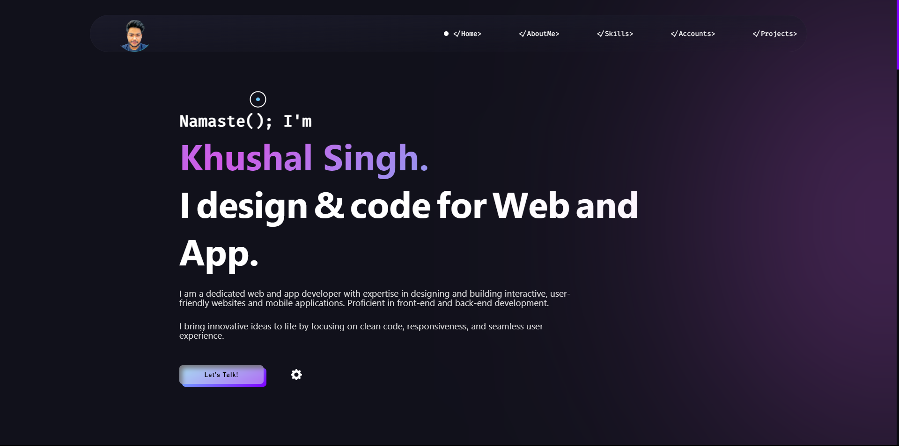
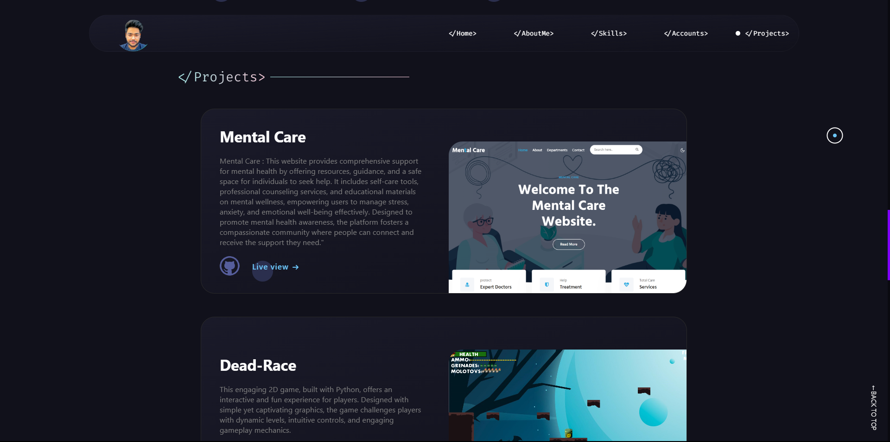

# Personal Portfolio Website

This is my personal portfolio website showcasing my projects, skills, and achievements.

## Features

- Clean and responsive design for mobile and desktop
- Sections for:
  - Projects 
  - Links to social media (LinkedIn, GitHub, etc.)
  - SEO optimization
  - Contact for direct inquiries

## Tech Stack

- **Frontend:** HTML, CSS, JavaScript
- **Hosting:** GitHub Pages

## Screenshots

### Home Page

### Projects Section

## Future Enhancements

- Adding dark mode support
- Adding animations and transitions for a smoother user experience

## Contact

For any inquiries, feel free to reach out:
- Email: khushalsingh9445@gmail.com
- LinkedIn: [thekhushalsingh](https://linkedin.com/in/thekhushalsingh)

## License

This project is licensed under the MIT License - see the [LICENSE](LICENSE) file for details.

